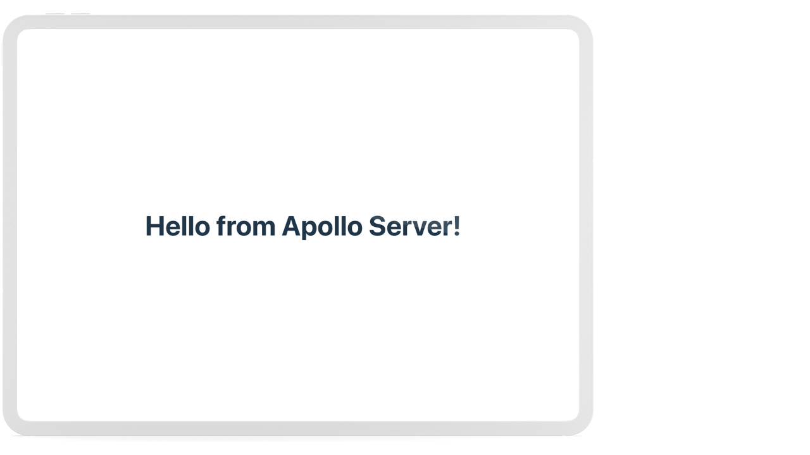
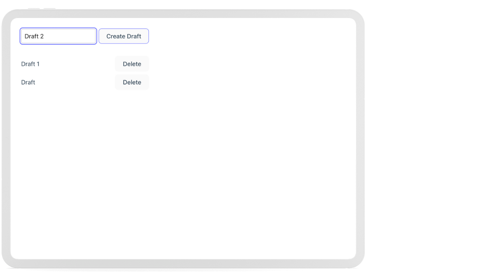
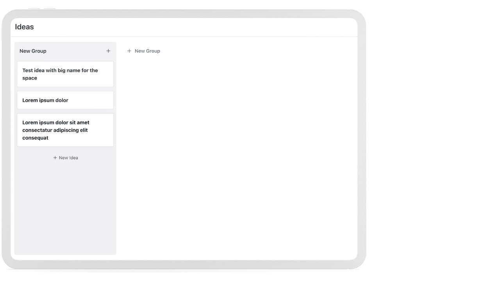

# GraphQL Practice App

A minimal monorepo demonstrating GraphQL client-server integration with Apollo Server and Apollo Client.

## Structure

```
/server    - Apollo Server (Node + TypeScript)
/client    - React app (Vite + TypeScript) with Apollo Client
```

## Iterations

### Iteration 1

Se tthe foundation up, spun up Apollo Server and a React client that talks to it, then wired in Prisma with MongoDB. Created the basic Draft and ScheduledPost models to store content and scheduling info.



### Iteration 2

Removed the old scaffolding and built out the real Draft CRUD. Added GraphQL queries/mutations for drafts, refactored the frontend and created a minimal UI for creating and deleting drafts.



### Iteration 3

Pivoted the app to a Kanban-style ideas board, similar to what is live on Buffer. Replaced the db schema with Kanban, Swimlane, and Idea models. Refactored the server to make it a bit more modular. Then started adding the board UI.


